[article.md](https://github.com/user-attachments/files/29050248/article.md)
# RFA Converter: a Revit button for exporting families to IFC and SAT

## Introduction

When working with Revit families, there is often a simple but inconvenient task: a family has to be transferred to another format.

For example, a BIM specialist may need to export an IFC file for exchange with another BIM platform, or a SAT file for further work with geometry in a CAD environment.

This can be done manually with standard Revit tools, but the workflow quickly becomes repetitive: open the family, select the export format, configure the settings, choose the output folder, save the file, check the parameters, and then repeat the same actions for the next family.

To reduce this manual work, I developed a small Revit add-in with a single button called **RFA Converter**. The purpose of the tool is to automate the export of `.rfa` family files to **IFC** and **SAT**, and to prepare parameters for further use in downstream BIM/CAD workflows.

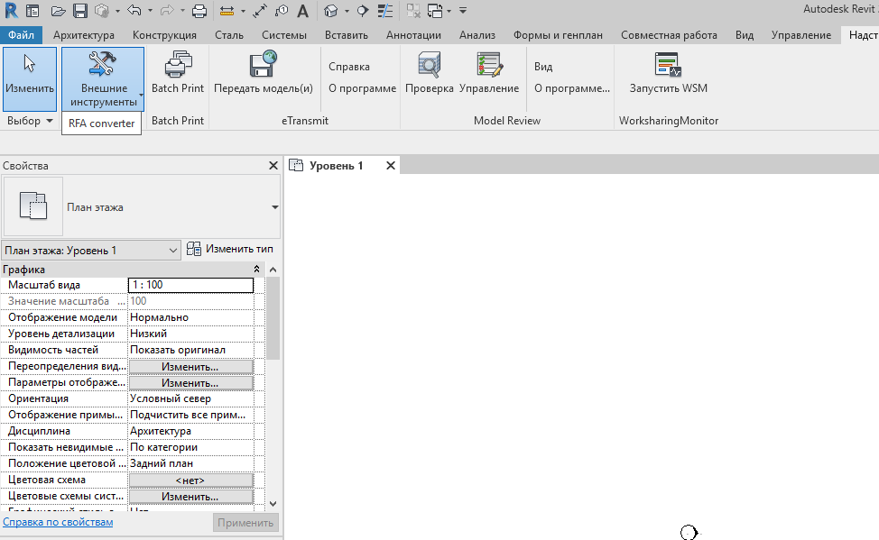

*Figure 1. RFA Converter button in the Revit interface.*

## Main idea

The plugin was initially planned as a simple button for exporting RFA files to IFC. During development, it became clear that IFC export alone was not enough.

Different tasks required different scenarios:

- transfer a BIM object through IFC;
- extract geometry through SAT;
- save family parameters into a separate table;
- prepare parameters for Model Studio;
- process not only one family, but a set of families from a selected folder.

As a result, the button became not just an exporter, but a small tool for preparing Revit families for further CAD/BIM integration.

## How the button works

After launching the **RFA Converter** command, the user first selects the required export scenario:

- **RFA to IFC**
- **RFA to SAT**

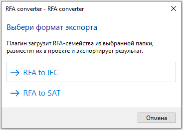

*Figure 2. Export mode selection.*

This order is more convenient than asking the user to select folders and settings immediately. First, the user defines what result is needed, and only after that the plugin shows the options related to the selected workflow.

## Exporting RFA to IFC

In the **RFA to IFC** mode, the plugin opens the selected families and exports them to IFC.

The user can select one of the supported IFC versions:

- IFC2x3;
- IFC4;
- IFC4.3.

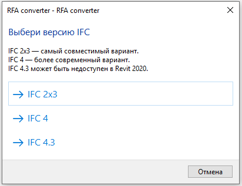

*Figure 3. IFC version selection.*

After selecting IFC export, the plugin includes an additional step: it asks whether parameter remapping for **Model Studio** should be applied.

The user can choose one of two options:

- **Yes** - remap the family parameters to Model Studio parameters;
- **No** - perform the export in the standard IFC/Revit parameter workflow.

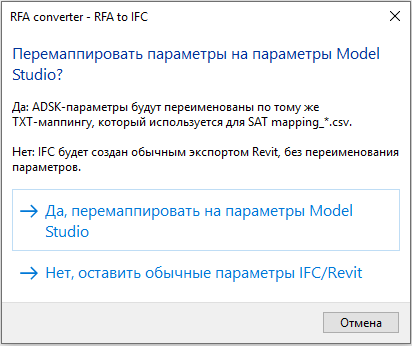

*Figure 4. Optional parameter remapping for Model Studio.*

This step is important because different systems may use different names for the same properties. A parameter may have one name in Revit, while another BIM/CAD system may expect a different system name for the same data.

In my case, I configured the remapping for **Model Studio** because this was required by my company workflow. However, the idea is not limited to Model Studio. The same approach can be adapted to any other software if that software requires its own parameter names or a different attribute structure.

## Standard IFC export and IFC export with remapping

The plugin supports two different IFC export scenarios.

The first scenario is **standard IFC export**. It is used when the goal is simply to get an IFC file from a Revit family without additional parameter preparation.

The second scenario is **IFC export with parameter remapping**. It is used when the exported IFC file should contain parameters prepared for a specific receiving system.

This makes the button more flexible. The same tool can be used both for fast conversion and for more controlled data preparation for a downstream BIM/CAD system.

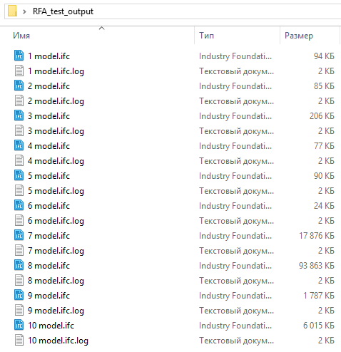

*Figure 5. Result of converting multiple RFA files to IFC.*

## Parameter handling

One of the important parts of the plugin is working with family parameters.

The plugin exports only the parameters that are actually present in the processed family. This is important because a common mapping file may contain many possible parameters, but not every family contains all of them.

If the plugin exported every possible row from the mapping file, the result would contain many empty or irrelevant parameters. The current logic avoids this and keeps the output cleaner.

If optional ADSK parameters are missing or not filled in, this is not treated as a critical error. The plugin does not stop the export. Instead, it treats this situation as a warning: the geometry can still be exported, but without the missing user-defined properties.

## Exporting RFA to SAT

The second main workflow is **RFA to SAT**.

SAT is used when geometry has to be extracted from a Revit family for further work in a CAD environment. For example, this file can be used in a workflow with nanoCAD, Model Studio, or another CAD tool that works with solid geometry.

When exporting to SAT, the plugin creates not only the SAT geometry file, but also a parameter table. This table is needed to transfer attribute information together with the geometry.

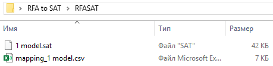

*Figure 6. SAT file and parameter table created after export.*

In batch SAT export, the plugin can process several families and create separate SAT files and parameter tables for them.

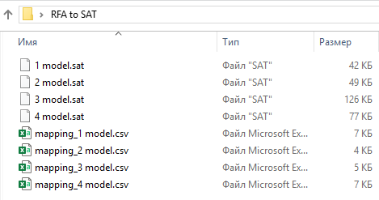

*Figure 7. SAT files and related parameter tables.*

The parameter table is created in the same general workflow that can later be used in the SAT to Model Studio integration chain. In other words, the plugin does not only export geometry; it also prepares data for the next stage of integration.

## Parameter table

For the SAT workflow, the plugin creates a parameter table for the exported object.

Only actual parameters found in the family are included. This makes the table easier to read and more useful for further processing.

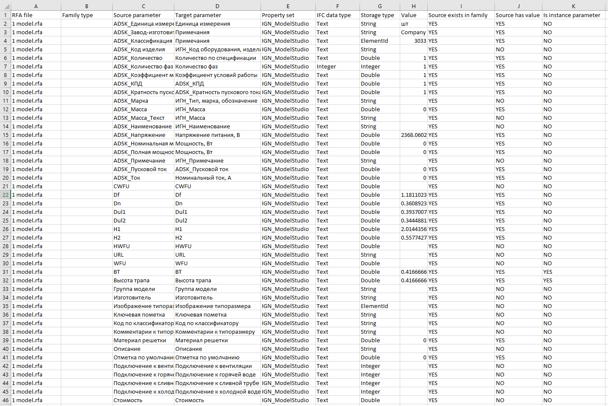

*Figure 8. Parameter table after export.*

The table can be used as an intermediate data layer between Revit and another CAD/BIM system. Geometry is transferred through SAT, and parameters are transferred through the table.

## Batch processing

Another important feature is the ability to work not with one family, but with a group of files.

In real tasks, it is rarely necessary to convert only one RFA file. Usually, there is a folder with several families that have to be processed in the same way.

The plugin allows the user to select a source folder that contains RFA files.

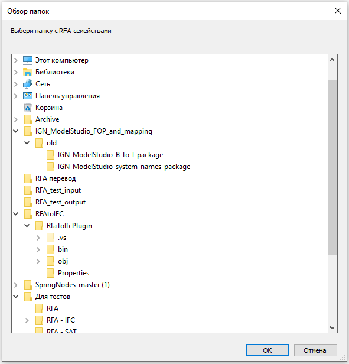

*Figure 9. Source folder selection.*

Then the user selects the target folder where IFC or SAT files will be saved.

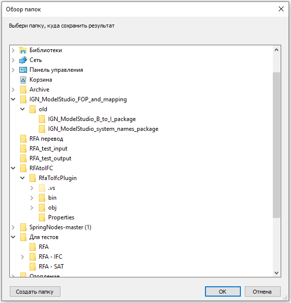

*Figure 10. Output folder selection.*

After that, the plugin processes the RFA files one by one and saves the results to the selected output folder.

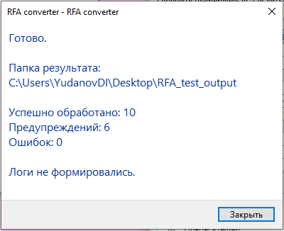

*Figure 11. Batch processing result.*

This saves time and reduces the number of manual actions. The user does not have to open each family separately and repeat the same export steps.

## Limitations

The plugin does not repair source Revit families and does not work as a universal converter for all possible BIM data.

If an RFA file is corrupted, contains unsupported elements, or cannot be exported correctly by Revit itself, this may affect the result.

It is also important to understand that SAT is not a BIM format. SAT transfers geometry, but parameters have to be saved separately in a table. The next task is to connect the geometry and the parameters on the side of the receiving system.

Within its intended scope, the plugin solves the main problem: it quickly and predictably prepares Revit family files for further use.

## Conclusion

**RFA Converter** is a small Revit add-in that automates the export of RFA families to IFC and SAT.

The current version supports IFC version selection, optional parameter remapping, SAT export with parameter tables, parameter filtering, and batch processing.

The remapping workflow was configured for Model Studio because it was required by my company, but the same idea can be adapted to other BIM/CAD systems.

For me, this project became a practical example of BIM process automation. The plugin does not try to replace Revit or downstream CAD/BIM software. Instead, it solves a specific task at the intersection of systems: it takes a Revit family, exports geometry and parameters, and prepares them for further use in another environment.
